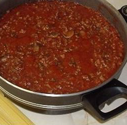

# Bolognese

*A rich, fragrant Bolognese sauce perfect for either lasagne or as Spaghetti Bolognese*

**Servings:** 4

**Ingredients**
- 3 tablespoons olive oil
- 1 onion (peeled and finely chopped)
- 1 carrot (peeled and chopped)
- 1 celery stick (finely chopped)
- 500 grams minced beef
- 1 glass red wine
- 700 ml passata (preferably home made if possible)
- 1 tablespoon tomato purée

**Directions**
1. Heat the olive oil over a medium-low in a large pan and add the onions, carrot and celery.
1. Cover and allow the vegetables to sweat for about 8-10 minutes, until soft.
1. Once the vegetables are soft, remove and set aside.
1. Add the minced beef and continue to cook for a further 5 minutes, stirring continuously until coloured all over.
1. Drain off excess fat if necessary, and add the vegetables back to the pan.
1. Season with salt and pepper and cook for a further 5 minutes, stirring occasionally.
1. Pour in the wine, stir well and cook for about 3 minutes to allow the alcohol to evaporate.
1. Add the passata and tomato purée, lower the heat to a bare simmer and continue to cook for 1 hour, uncovered until you get a beautiful rich sauce.
1. After about 30 minutes, taste for seasoning.

**Note**: This sauce is best cooked for at least 1 hour, preferably 2 on a very low heat. the longer you cook it, the richer the flavour
