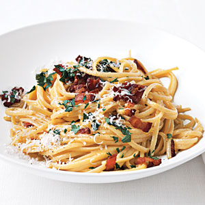

# Bucatini carbonara

*Bucatini alla carbonara*

*This is one of the classic Italian dishes, not to be confused with the English carbonara which uses cream. Italians would never dream of adding cream to a carbonara, it would be considered an insult to a great dish. Using bucatini as the pasta of choice allows the sauce to run through the centre of the pasta, making this dish supreme. Buon appetito!*

**Serves:** 4

## Ingredients
- 250 grams smoked pancetta
- 3 tablespoons extra virgin olive oil
- 15 grams salted butter
- 4 eggs
- 4 tablespoons Percorino Romano (freshly grated)
- 4 tablespoons fresh flat leaf parsley (finely chopped)
- 500 grams bucatini
- salt and pepper to taste

## Method
1. Cut the pancetta into short little strips, about 5 mm wide.
1. Heat the oil and butter in a large frying pan over a medium heat and fry the pancetta for about 5 minutes until golden and crispy, stirring occasionally. Remove from the heat and set aside.
1. Meanwhile, whisk the eggs in a bowl with half of the Pecorino Romano. Add in the parsley with five turns of the pepper mill.
1. Cook the bucatini in a large saucepan of boiling salted water until al dente, drain and the tip back into the same pan. 
1. Add in the pancetta and pour over the egg mixture. 
1. Mix everything together for 30 seconds with a wooden spatula (the heat from the pasta will be sufficient to cook the egg.)
1. Season with salt and pepper and serve immediately with the remaining Percorino Romano on top.
