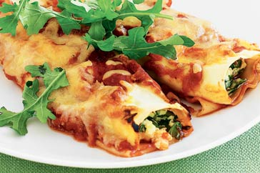

# Cannelloni filled with rocket, spinach and ricotta cheese

*Cannelloni del nonno*

*This classic baked pasta dish speaks for itself, it is one of the true great Italian dishes. You can use Parmesan instead of Pecorino.*

**Serves:** 6 - 8

## Ingredients
- 400 grams fresh pasta dough
- 720 ml passata
- 15 fresh basil leaves
- 30 grams Pecorino (freshly grated)

### For the filling
- 500 grams ricotta cheese
- 150 grams frozen spinach (defrosted and squeezed to remove excess water)
- 150 grams rocket leaves (chopped)
- 1/4 teaspoon nutmeg (freshly grated)
- 60 grams Pecorino (freshly grated)
- salt and pepper to taste

### For the béchamel sauce
- 100 grams salted butter
- 100 grams plain flour
- 1 litre full fat milk (cold)
- 1/4 teaspoon nutmeg (freshly grated)

## Method
1. Preheat the oven to 180°C.
1. Pour the passata into a large bowl with the basil leaves. Season with salt and pepper, mix together and set aside.
1. To prepare the béchamel sauce, melt the butter in a large saucepan over a medium heat. Stir in the flour and cook for 1 minute until it turns a light brown colour. 
1. Gradually whisk in the milk, reduce the heat and cook for 10 minutes, whisking continuously. Once it has thickened, stir in the nutmeg. Season with salt and pepper and set aside to cool slightly.
1. The prepare the filling, place all the ingredients in a large bowl, season with salt and pepper and use a fork to mix everything together. Leave in the fridge to rest while you prepare the pasta.
1. Flatten the prepared dough with a rolling pin so that it can fit through the rollers of a pasta machine. Flour the pasta lightly on both sides and start to roll it from the widest setting to the thinnest. 
1. Cut into rectangles measuring 7 x 15 cm (you will need 26 sheets of pasta).
1. Prepare a large saucepan with plenty of boiling salted water and start to cook the pasta sheets - work in batches of five. Boil the sheets for 1 minute then remove and place immediately in a large bowl of cold water, remove the sheet of pasta place on a clean tea towel.
1. Place 1 ½ tablespoons of filling across each pasta sheet and start to roll up the pasta from the narrow side going forward. To seal the cannelloni, overlap the pasta sheet by about 2 cm. Repeat until all the pasta sheets are filled.
1. Select a rectangular dish measuring 25 x 35 cm and pour in a third of the béchamel sauce. Spread evenly.
1. Place half of the cannelloni onto the béchamel layer with the seam facing down. Spoon over half of the passata and half of the remaining béchamel sauce.
1. Build up the second layer of cannelloni and spoon over the remaining passata. Spread over the remaining béchamel sauce.
1. Finish by sprinkling over the Pecorino cheese and bake in the centre of the oven for 35 minutes or until coloured and crispy.
1. Once ready, leave to rest for 5 minutes out of the oven. It will be easier to cut and serve as the layers will hold together.