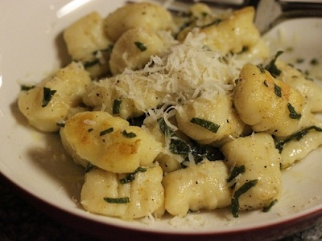

# Gnocchetti with courgettes in butter and sage sauce

*Gnocchetti burro e salvia*

*This dish, although a little fiddly to prepare is well worth the effort, and extremely satisfying. Always use fresh sage rather than the dried variety.*

**Serves:** 2

## Ingredients
- 300 grams floury potatoes (unpeeled)
- 1 small egg (lightly beaten)
- 100 grams plain flour (plus extra for dusting)
- 100 grams salted butter
- 2 medium courgettes (cut into 1 cm cubes)
- 1 tablespoon fresh sage (finely sliced)
- 300 grams Parmesan (freshly grated)
- salt and pepper to taste

## Method
1. Cook the potatoes in a large saucepan of boiling water for 25 - 30 minutes until tender. Drain well and allow to cool slightly.
1. Peel the potatoes and press the flesh through a potato ricer into a large bowl.
1. While the potatoes are still warm, add 2 pinches of salt, the egg and the flour. Lightly mix and then turn out onto a floured surface.
1. Knead lightly until the ingredients form a soft, slightly sticky dough (do not overwork, or the gnocchetti will be tough.)
1. Cut the dough into 2 and roll each piece into a long sausage shape, about 1.5 cm in diameter. Cut into 2 cm pieces.
1. Lay the gnocchetti on a lightly floured clean tea towel.
1. Bring a large saucepan of salted water to the boil. Drop in the gnocchetti and cook for about 2 minutes (they are ready when they float to the surface). Remove from the water with a slotted spoon and drain.
1. Meanwhile, melt the butter in a large frying pan over a medium heat. Once hot, add the courgettes and cook for 3 minutes before stirring in the sage. Season with salt and pepper and remove from the heat.
1. Place the gnocchetti in the pan and toss everything together.
1. Serve immediately, sprinkled with the Parmesan.