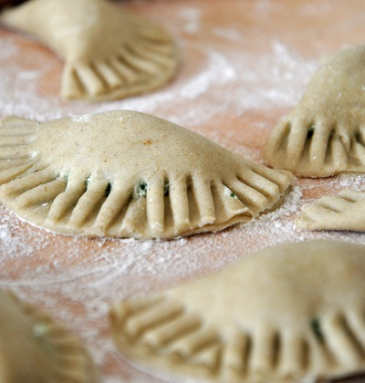

# Name

*Mezzelune con prosciutto e pomodori secchi*

*This divine fresh pasta-filled dish, combines the delicate flavours of ricotta and Pecorino cheese with the rich flavour of freshly fried chorizo.*

**Serves:** 6

## Ingredients
- 200 ml extra virgin olive oil
- 200 grams chorizo (cut into 5 mm slices)
- 400 grams fresh pasta dough
- 2 eggs (beaten)
- 100 gram piece Pecorino cheese

### For the filling
- 750 grams ricotta cheese
- 200 grams cooked ham (finely chopped)
- 150 grams sun dried tomato in oil (drained and chopped)
- 15 fresh basil leaves (chopped)
- 100 grams Pecorino cheese (freshly grated)
- salt and pepper to taste

## Method
1. Place all the ingredients for the filling in a large bowl and mix together with a fork.
1. Season with salt and pepper, and then cover with cling-film and leave to rest in the fridge for 10 minutes.
1. Meanwhile, put the extra virgin olive oil in a frying pan over a medium heat and fry the chorizo for 3 minutes, stirring occasionally. Set aside.
1. Flatten the prepared pasta dough with a rolling pin so that it can fit through the rollers of a pasta machine. Flour the pasta lightly on both sides and start to roll it, from the widest setting to the thinnest. Make sure that you keep the pasta dusted with flour at all times.
1. Lay the pasta sheets on a well-floured surface. Cut into discs using an 8 cm cutter (you should get about 30 discs).
1. Place about a teaspoon of filling in the middle of each disc, sharing it out equally.
1. Brush over the edges of the disc with the beaten egg and fold over to make a half moon shape.
1. Press down on the edges of the pasta with your fingertips to seal, and with a fork, press the edges again to secure the filling make make an imprint.
1. Cook the mezzelune in a large saucepan of boiling salted water for 1 minute (working in batches if necessary). Drain and place in the middle of a large serving plate. Season with salt and pepper.
1. Top with the chorizo and the oil, sprinkle with shavings of Pecorino cheese and serve immediately.