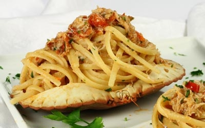

# Linguine with crab, fresh chilli and lemon zest

*Linguine con granchio e limone*

*This is a great pasta dish from Amalfi, the secret is simple: All the ingredients mush be fresh and the pasta has to be al dente. Do no be tempted to add any cheese to this dish.*

**Serves:** 4

## Ingredients
- 450 grams dressed crab (including the shell)
- 5 tablespoons extra virgin olive oil
- 2 garlic cloves (peeled and finely chopped)
- 1 medium-hot red chilli (de-seeded and finely chopped)
- 3 tablespoons flat leaf parsley (freshly chopped)
- zest of 1 lemon
- 3 tablespoons of lemon juice (freshly squeezed)
- 500 grams linguine
- salt to taste

## Method
1. Using a tablespoon, scoop out the crab meat from the shell and claws into a bowl and mix together the white and brown meat.
1. Heat the oil in a large frying pan over a low heat and fry the garlic and chilli together for 30 seconds.
1. Add in the crab with the parsley, lemon zest and juice. Cook for 1 minute until the crab has heated through. Season with salt and set aside.
1. Meanwhile, cook the pasta in a large saucepan of boiling salted water until al dente. Drain and tip back into the same pan, off the heat.
1. Spoon in the crab sauce and stir everything together for 30 seconds to allow the flavours to combine.
1. Serve immediately.