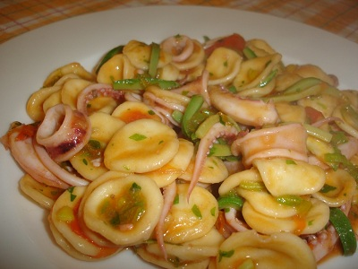

# Pasta shells and beans with squid and chorizo

*Orecchiette con calamari e chorizo*

*The flavours and colours of this dish are simply amazing, making this a perfect pasta dish for any party.*

**Serves:** 6

## Ingredients
- 100 grams tinned chick peas (drained)
- 100 grams tinned borlotti beans (drained)
- 15 cherry tomatoes (quartered)
- 1 medium hot red chilli (de-seeded and thinly sliced)
- 1 garlic clove (peeled and finely chopped)
- 3 tablespoons fresh flat leaf parsley (chopped)
- 2 tablespoons freshly squeezed lemon juice
- 8 tablespoons extra virgin olive oil
- 400 grams squid
- 80 grams chorizo (thinly sliced)
- 500 grams orecchiette shells
- salt to taste

## Method
1. Put the chickpeas and beans in a large bowl with the tomatoes, chilli, garlic and parsley.
1. Pour in the lemon juice and 5 tablespoons of the oil.
1. Season with salt and toss gently together, set aside.
1. Cut open the body pouch of each squid along one side and use the tip of a small sharp knife to score the inner side into a fine diamond pattern. Then cut each pouch first in half length-ways and then across into 7 cm pieces.
1. Heat the remaining oil in a large frying pan over a high heat and add in the squid pieces (scored side up so that they will curl attractively). Also add in the tentacles.
1. Sear for about 30 seconds, then turn them over and continue to sear for another 30 seconds until golden and caramelised. Season with salt, add the chorizo to the pan and cook for a further minute, keeping the heat high. Set aside.
1. Cook the pasta in a large saucepan of boiling salted water until al dente. Drain and tip back into the same pan.
1. Return the saucepan to a low heat and pour in the bean mixture, the squid and the chorizo. Stir everything together for 1 minute to allow the flavours to combine.
1. Serve immediately and please do not be tempted to serve it with any grated cheese on top.