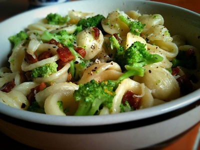

# Pasta shells with sprouting broccoli, chilli and pine nuts

*Orecchiette al broccoli*

*The fresh, firm al dente broccoli mix well with the nutty flavours of this dish, and the mild spicy undertones really bring out the flavours.*

**Serves:** 4

## Ingredients
- 8 tablespoons olive oil
- 300 grams sprouting broccoli (cut into 2 cm pieces)
- 2 garlic cloves (finely sliced)
- 6 tablespoons pine nuts
- 1 medium hot chilli (de-seeded and finely chopped)
- 100 ml dry white wine
- 500 grams orecchiette shells
- 150 grams Parmesan (freshly grated)
- 10 fresh basil leaves
- salt to taste

## Method
1. Heat the oil in a large frying pan over a medium heat and stir fry the broccoli with the garlic, pine nuts and the chilli for 3 minutes, stirring occasionally with a wooden spatula.
1. Season with salt, add the white wine and continue to cook over a medium heat for a further 8 minutes, making sure that the broccoli stays al dente.
1. Meanwhile, cook the pasta in a large saucepan of boiling salted water until al dente. Drain and tip back into the same pan.
1. Add the broccoli mix to the pan with the pasta and place the pan over a low heat.
1. Sprinkle over the Parmesan cheese and mix everything together for 20 seconds to allow the sauce to coat the pasta evenly.
1. Serve immediately, garnished with the basil leaves.