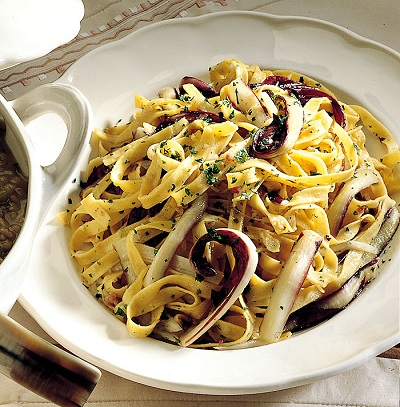

# Penne with red chicory, sausages and red wine

*Penne alla trevisana*

*This wonderful dish has great flavours, very filling and most important of all, very simple to prepare. Make sure the sausages are of top quality, preferably Italian.*

**Serves:** 4

## Ingredients
- 150 grams good quality pork sausages
- 3 tablespoons extra virgin olive oil
- 1 red onion (peeled and finely chopped)
- 2 whole red chicory (washed and shredded)
- 100 ml red wine
- 500 grams penne rigate
- 30 ml double cream
- 2 tablespoons fresh flat leaf parsley (chopped)
- 30 grams Parmesan (freshly grated)
- salt and pepper to taste

## Method
1. Remove the skins from the sausages, and discard.
1. Heat the oil in a large frying pan over a low heat and fry the sausage meat and onion for 5 minutes. Stir occasionally with a wooden spatula to allow the meat to crumble.
1. Add the chicory, season with salt and pepper and continue to cook for 1 minute.
1. Pour in the wine and continue to cook for a further minute to allow the alcohol to evaporate then set aside, away from the heat.
1. Meanwhile, cook the pasta in a large saucepan of boiling salted water until al dente.
1. Once the pasta is ready, return the sauce to a medium heat. Drain the pasta and tip into the frying pan with the sauce.
1. Pour in the cream with the parsley, sprinkle with Parmesan then toss everything together over a medium heat for 3 seconds to allow the flavours to combine.
1. Serve immediately.