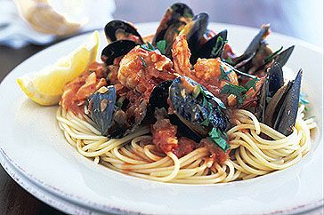

# Spaghetti Marinara

**Prep Time:** 40 minutes
**Cooking Time:** 50 minutes
**Serves:** 6

## Ingredients
### Tomato sauce
- 2 tablespoons olive oil
- 1 onion (finely chopped)
- 1 carrot (sliced)
- 2 garlic cloves (crushed)
- 425 grams tinned tomatoes
- 125 ml white wine
- 1 teaspoon sugar

### Marinara
- 20 black mussels
- 60 ml white wine
- 60 ml fish stock
- 1 garlic clove (crushed)
- 375 grams spaghetti
- 30 grams butter
- 125 grams calamari rings
- 125 grams skinless firm white fish fillets (cubed)
- 200 grams raw prawns (peeled and de-veined)
- 10 grams flat leaf parsley (freshly chopped)
- 200 grams clams

## Method
### For the sauce
1. Heat the oil in a deep frying pan, add the onion and carrot and stir continuously over a medium heat for 10 minutes, until the vegetables are golden.
1. Add the garlic, tomato, wine and sugar and bring to the boil.
1. Immediately reduce the heat, and gently simmer for 30 minutes, stirring occasionally.

### For the marinara
1. Wash the mussels and clams thoroughly, discarding any that have broken shells or fail to close when you tap them.
1. Heat the wine with the stock and garlic in a large pan. 
1. Add the mussels and clams, cover and shake the pan over a high heat for 4 - 5 minutes; after 3 minutes, start removing opened mussels. After 5 minutes, discard any unopened mussels. Reserve the cooking liquor.
1. Cook the spaghetti in a large pan of salted boiling water until al dente, drain and tip back into the same pan.
1. Meanwhile, melt the butter in a frying pan, add the calamari, fish and prawns in batches and stir-fry for 2 minutes, or until just cooked through.
1. Add the seafood to the tomato sauce with the reserved liquid, mussels, parsley and clams.
1. Stir until the seafood is heated through.
1. Add the spaghetti to the pan and toss until well combined.