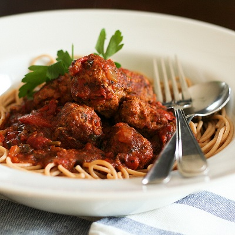

# Spaghetti with chicken meatballs

**Prep Time:** 30 minutes (plus chilling)
**Cooking Time:** 1 hour 30 minutes
**Serves:** 4 - 6

## Ingredients
- 500 grams spaghetti
- 2 tablespoons oregano (freshly chopped)
- For the meatballs
- 500 grams chicken mince
- 60 grams Parmesan (freshly grated)
- 160 grams fresh white breadcrumbs
- 2 garlic cloves (crushed)
- 1 egg
- 1 tablespoon flat leaf parsley (freshly chopped)
- 1 tablespoon sage (freshly chopped)
- 3 tablespoons vegetable oil
- black pepper

### Tomato sauce
- 1 tablespoon olive oil
- 1 onion (finely chopped)
- 2 kg ripe tomatoes (chopped)
- 2 bay leaves
- 30 grams fresh basil leaves
- 1 teaspoon course ground black pepper

## Method
### For the meatballs
1. In a large bowl, mix together the mince, Parmesan, breadcrumbs, garlic, egg, pepper and herbs. 
1. Shape a tablespoon of mixture into small balls and chill for 30 minutes, until firm.
1. Heat the oil in a shallow pan and fry the balls in batches until golden brown; turn often by shaking the pan. Drain onto paper towels.

### For the tomato sauce
1. Heat the oil in a large pan, add the onion and fry for 1 - 2 minutes. 
1. Add the tomato and bay leaves, cover and bring to the boil, stirring continuously.
1. Reduce the heat to low, partially cover and cook for 50 - 60 minutes.

### To cook
1. Add the meatballs, basil and pepper to the pan and simmer for 10 - 15 minutes.
1. Cook the spaghetti in a pan of salted boiling water until al dente, drain and return to the same pan.
1. Add some of the tomato sauce to the pasta and toss.
1. Serve the pasta with sauce and meatballs, sprinkled with oregano and extra Parmesan.