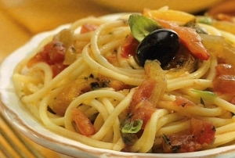

# Spaghetti with yellow peppers, chilli and herbs.

*Spaghetti con peperoni alle erbe.*

*This amazing vegetarian dish is simply amazing, it does not need any meat of any kind as it speaks for itself. The flavours work to complement each other rather than oppose one another, it really gets the mouth watering. You can use aubergines instead of peppers if you like.*

**Serves:** 4

## Ingredients
- 8 tablespoons olive oil
- 2 cloves of garlic (peeled and finely sliced)
- 4 yellow peppers (de-seeded and finely sliced)
- 1 teaspoon dried chilli flakes
- 1 teaspoon fresh thyme leaves
- 1 tablespoon fresh rosemary leaves (finely chopped)
- 2 tablespoons fresh flat leaf parsley (finely chopped)
- 500 grams spaghetti
-   salt to taste

## Method
1. Heat the oil in a large frying pan over a low heat and gently fry the garlic and peppers for 2 minutes.
1. Add the chilli with all the herbs and continue to cook for a further 6 minutes, stirring occasionally with a wooden spoon. Season with salt and set aside, away from the heat.
1. Meanwhile, cook the pasta in large saucepan of boiling salted water until al dente. Drain and tip back into the same pan.
1. Pour in the pepper mixture and stir everything together over a low heat for 30 seconds to allow the sauce to coat the pasta evenly. 
1. Serve immediately.