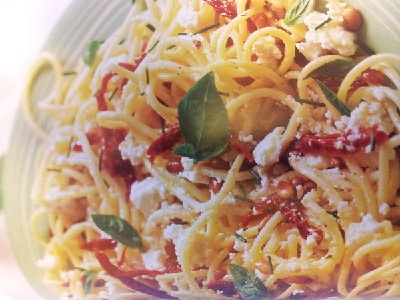

# Spaghetti with ricotta cheese and toasted pine nuts

*Spaghetti con ricotta e pinoli*

*This dish is perfect all year round, it is especially nice with warm bread and a glass of cold Italian white wine.*

**Serves:** 4

## Ingredients
- 6 tablespoons pine nuts
- 250 grams ricotta cheese
- 100 grams sun-dried tomatoes in oil (drained and cut into thin strips)
- 3 tablespoons chives (finely chopped)
- 1/4 teaspoon nutmeg (freshly grated)
- 10 fresh basil leaves (chopped, plus extra to serve)
- 4 tablespoons extra virgin olive oil
- 2 tablespoons hot water
- 500 grams spaghetti
- salt and pepper to taste

## Method
1. Heat a dry frying pan and toast the pine nuts until golden brown all over, and set aside.
1. Place the ricotta cheese in a large bowl with the sun-dried tomatoes, chives, nutmeg, pine nuts and basil. Pour over the oil and hot water and season with salt and pepper. Mix everything together and allow to rest at room temperature.
1. Meanwhile, cook the pasta in a large saucepan of boiling salted water until al dente. Drain and tip back into the large bowl with the ricotta mixture.
1. Gently fold everything together for 30 seconds to combine the ricotta mixture with the pasta, and serve.