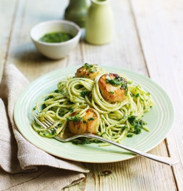

# Spaghettini with scallops and parsley pesto

*Spaghettini con capesante in salsa verde*

*Scallops, parsley and garlic is a combination made in heaven, this recipe is quick and colourful and will shout freshness every time.*

*Do not use frozen scallops and never use curly parsley.*

**Serves:** 4

## Ingredients
- 45 grams salted butter
- 250 grams small scallops (without the coral)
- 50 grams fresh flat leaf parsley (leaves only)
- 50 grams pine nuts
- 2 tablespoons salted capers (rinsed)
- 1 garlic clove (peeled)
- 130 ml extra virgin olive oil
- zest of 1 lemon
- 500 grams spaghettini
- salt and pepper to taste

## Method
1. Melt the butter in a frying pan and cook the scallops for 1 minute on each side. Set aside.
1. Place the parsley, pine nuts, capers and garlic in a food processor. Drizzle in the oil and purée until smooth.
1. Transfer the parsley mixture into a large bowl and mix in the scallops with the lemon zest. Season with salt and pepper.
1. Meanwhile, cook the pasta in a large saucepan of boiling salted water. Drain and tip into the bowl with the pesto and scallops.
1. Gently toss everything together for 30 seconds allowing the pesto to coat the pasta evenly.
1. Serve immediately.