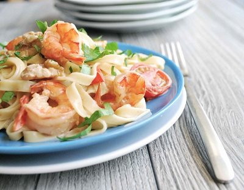

# Tagliatelle with prawns and brandy cream sauce

*Tagliatelle con gamberi brandy*

*This delicate pasta dish is full of impressive flavours, and is perfect for a romantic dinner. You can substitute the brandy for Marsala wine for a subtle sauce.*

*Make sure you don't overcook the prawns.*

**Serves:** 4

## Ingredients
- 30 grams salted butter
- 4 tablespoons olive oil
- 2 shallots (peeled and finely chopped)
- 60 grams walnuts (chopped)
- 300 grams uncooked prawns (peeled and de-veined)
- 10 cherry tomatoes (quartered, seeds removed)
- 60 ml brandy
- 250 ml double cream
- 1 tablespoon balsamic vinegar
- 400 grams fresh egg tagliatelle
- 2 tablespoons flat leaf parsley (chopped)
- salt and pepper to taste

## Method
1. Melt the butter with the oil in a large frying pan over a low heat and fry the shallots and walnuts for 2 minutes, stirring occasionally with a wooden spoon.
1. Increase the heat to medium, add the prawns and tomatoes, season with salt and pepper and continue to cook for 30 seconds.
1. Pour in the brandy and continue to cook for a further minute to allow the alcohol to evaporate.
1. Add the cream with the balsamic vinegar and cook, stirring, for 2 minutes. Set aside.
1. Meanwhile cook the pasta in a large saucepan of boiling salted water until al dente. Drain and tip back into the same pan.
1. Pour in the cream sauce with the parsley and toss everything together for 30 seconds to allow the flavours to combine.
1. Serve immediately.