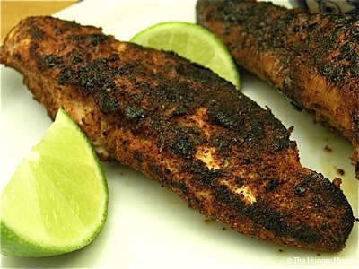

# Blackended Chicken 

   
*This recipe is so called because the spice mixture used to season the meat leaves it with a black finish. While this dish calls for chicken as the main ingredient, fish can also be used with great affect.*

*The chicken goes really well with any type of salad, even replacing the chicken in a classic Caesar salad, or in a club sandwich.*

**Serves**: 4    
## Ingredients
- 4 chicken breasts
- 1 tablespoon oil
- 1 tablespoon butter

**For the blackened spice mix**  
- 1 tablespoon salt
- 1 ½ teaspoon garlic powder
- 1 ½ teaspoons freshly ground black pepper
- 1 teaspoon ground white pepper
- 1 teaspoon onion powder
- 1 teaspoon ground cumin
- ½ teaspoon cayenne pepper
- ½ teaspoon paprika

## Directions
1. Pre-heat the oven to 200°C.
2. Mix all the spices together.
3. The chicken breasts can now be either completely rolled in the spices or just coated on the skin side.
4. Mix together the oil and butter in a large frying pan, and once the butter is bubbling, add the chicken breast skin-side down  and cook for a few minutes until blackened, then turn the chicken and continue to cook until blackened on the other side.
5. Finish the chicken in the oven for about 10 minutes.
