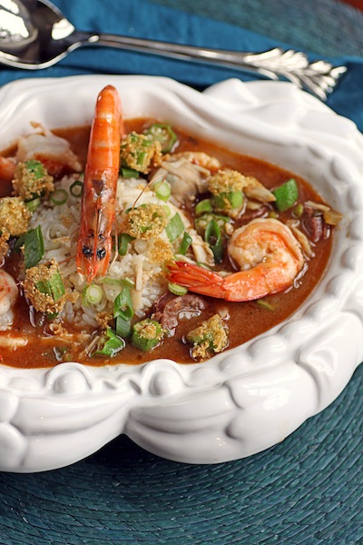

 # Shellfish Gumbo

*Gumbo is a soup, but is served over rice as a main course. In this version, chilli is added to the "Holy trinity" of onion, celery and sweet pepper.*

**Serves:** 6 People

## Ingredients
- 450 grams fresh mussels
- 450 grams raw prawns (in their shells)
- 1 cooked crab (about 1 kg)
- small bunch of parsley (leaves chopped and stalks reserved)
- 150 ml vegetable oil
- 115 grams plain flour
- 1 green pepper (de-seeded and chopped)
- 1 large onion (chopped)
- 2 celery sticks (sliced)
- 1 fresh green chilli (de-seeded and chopped)
- 3 garlic cloves (finely chopped)
- 75 grams smoked spiced sausage (skinned and sliced)
- 275 grams white long grain rice
- 6 spring onions (sliced)
- Tabasco sauce (to taste)
- salt

## Method
### To make the stock
1. Wash the mussels in several changes of cold water, pulling away the black "beards".
1. Discard any mussels that are broken, or those that do not close when tapped firmly.
1. Bring 250 ml water to the boil in a deep pan.
1. Add the prepared mussels, cover the pan tightly with a glass lid and cook over a high heat, shaking frequently, for 3 minutes.
1. As the mussels open, lift them out with tongs into a chinois or fine-meshed conical sieve set over a bowl.
1. Discard any mussels that fail to open.
1. Shell the mussels, discarding most of the shells but reserving 12 - 18.
1. Peel the prawns and de-vein, setting aside.
1. Put the shells and heads into the pan.
1. Remove the meat from the crab, separating the brown and white meat.
1. Add all the pieces of shell to the pan and stir in 1 teaspoon of salt.
1. Return the mussel liquid from the bowl to the pan and make it up to 2 litres with water.
1. Bring the shellfish stock to the boil, skimming it regularly.
1. When there is no more froth on the surface, add the parsley stalks and simmer for 15 minutes.
1. Cool the reduced stock, then add enough water to make the stock up to 2 litres.
### To make the gumbo
1. Heat the oil in a heavy pan and stir in the flour.
1. Stir constantly over a medium heat with a wooden spoon or whisk until the roux reaches a golden-brown colour.
1. Immediately add the pepper, onion, celery, chilli and garlic.
1. Continue cooking for about 3 minutes until the onion is soft.
1. Stir in the sausage.
1. Reheat the stock.
1. Stir the brown crab meat into the roux, then ladle in the hot stock a little at a time, stirring constantly until it has been smoothly incorporated.
1. Bring to a low boil, partially cover the pan, then simmer for 30 minutes.
1. Meanwhile, cook the rice in plenty of lightly salted water until the grains are tender.
1. Add the prawns, mussels, white crab meat and spring onions to the gumbo.
1. Return to the boil and season with salt if necessary.
1. Taste and add a dash or two of Tabasco sauce to heighten the heat generated by the chilli.
1. Simmer for a further minuted, then add the chopped parsley leaves and the reserved mussel shells.
1. Serve immediately, ladling the soup over hot rice in soup plates.
