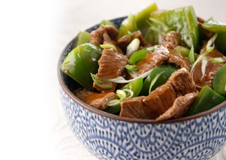

# Beef in oyster sauce

*This dish lends itself to a serving of steamed rice and Chinese leaves in soy sauce. Make sure you use a good quality oyster sauce that does not taste of fish.*

**Serves:** 4

## Ingredients
- 350 grams lean beef steak
- 2 teaspoons light soy sauce
- 2 teaspoons dry sherry or rice wine
- 1 teaspoon cornflour
- 1½ tablespoons groundnut oil
- 70 ml Chinese chicken stock
- 1½ tablespoons oyster sauce
- 1 teaspoon cornflour (mixed with 1 teaspoon water)

**Garnish** 
- 1½ tablespoons spring onions (finely chopped)

## Method
1. Cut the beef into thin slices, about 5 cm long and put them in a bowl.
1. Add the soy sauce, sherry or rice wine and cornflour.
1. Leave to marinate for 20 minutes.
1. Heat the oil in a wok or large frying pan until it is very hot and almost smoking.
1. Stir fry the beef slices, then remove and drain on kitchen paper.
1. Wipe the wok clean and re-heat it over a high heat.
1. Add the chicken stock and oyster sauce.
1. Bring the liquid to the boil, then add the cornflour mixture and simmer for 2 minutes.
1. Return the drained beef to the pan and coat all the slices thoroughly with the sauce.
1. Turn the mixtrure onto a serving platter and garnish it with the spring onions and serve at once.