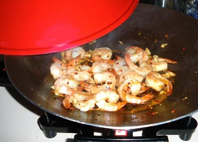

# Braised prawns

*This method of quick braising is very simple. Street vendors throughout southern China sell this dish because it is uncomplicated and takes only minutes to prepare. It is also excellent cold and makes a nice dish for an exotic picnic.*

**Serves:** 4

## Ingredients
- 225 g rams prawns (shelled and de-veined)

**Braising sauce**  
- 1½ tablespoons spring onions (finely chopped)
- 2 teaspoons fresh ginger (finely chopped)
- 1 tablespoon dry sherry or rice wine
- 1 tablespoon light soy sauce
- 70 ml Chinese chicken stock

## Method
1. Wash and pat dry the prawns on kitchen paper.
1. Combine the braising sauce ingredients together in a wok or large saucepan and bring to the boil.
1. Turn the heat down low and simmer for 2 minutes.
1. Add the prawns and stir, mixing them in well.
1. Cover the pan and braise for 2 minutes.
1. Serve at once or allow to cool and serve cold.