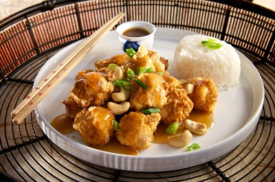

# Cashew chicken

*This dish exemplifies the Chinese penchant for contrasting textures. Here, tender succulent pieces of chicken are used with sweet crunchy cashew nuts. The original Chinese version would have been made with peanuts because cashews do not feature in Chinese cookery.*

**Serves:** 4

## Ingredients
- 225 grams boneless chicken breasts (skinned)
- 1 egg white
- 1 teaspoon salt
- 1 teaspoon cornflour
- 150 ml groundnut oil
- 50 grams cashew nuts
- 2 teaspoons dry sherry or rice wine
- 1 tablespoon light soy sauce

**Garnish** 
- 1 tablespoon spring onions (finely chopped)

## Method
1. Cut the chicken breasts into 1 cm cubes.
1. Combine them with the egg white, salt and cornflour in a small bowl.
1. Refrigerate for about 20 minutes so that the flavours combine.
1. Heat the oil in a wok or deep frying pan until it is moderately hot.
1. Add the chicken mixture and stir-fry it quickly in the oil to keep it from sticking.
1. Cook it until it turns white, which should take about 2 minutes.
1. Drain the chicken cubes in a colander, reserving 1 tablespoon of the oil.
1. Clean the wok and return the reserved oil to the wok.
1. Re-heat the wok until it is very hot.
1. Add the rest of the ingredients along with the chicken.
1. Stir fry the mixture for 2 minutes, then turn out onto a platter and garnish with the spring onions.