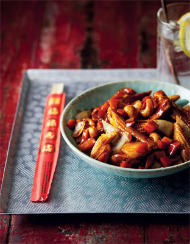

# Chicken and Peanut

*When cooking Chinese food, it’s always important to think about the flavours and textures of the ingredients. Juicy chicken combined with succulent baby corn and salty, crunchy cashew nuts come together beautifully in this dish.*

**Serves:** 2

## Ingredients
- 1 tbsp groundnut oil
- 3 garlic cloves, crushed
- ½ tsp finely chopped fresh ginger
- 2 chicken breast fillets, sliced
- 1 onion, roughly chopped
- 1 carrot, finely diced
- 40g (¼ cup) tinned water chestnuts, sliced into bite-sized discs
- 30g (¼ cup) tinned bamboo shoots
- 3 baby corn cobs, cut into bite-sized pieces
- 2 tbsp oyster sauce
- 1 tbsp dark soy sauce
- 80ml (⅓ cup) chicken stock ¼ tsp salt
- ¼ tsp white pepper
- 1 tbsp cornflour (cornstarch) mixed with 2 tbsp water
- 30g (1oz) salted, roasted cashew nuts
- 1 tsp sesame oil

## Method
1. Place a wok over a medium–high heat, add the groundnut oil, garlic and ginger and fry for about 30 seconds, until fragrant. 
1. Add the chicken and stir-fry for 2 minutes. Add the onion, carrot, water chestnuts, bamboo shoots and baby corn and stir-fry for a further 2 minutes. 
1. Spoon in the oyster sauce and soy sauce, pour in the stock and add the salt and pepper. 
1. Stir well, bring to the boil and then turn down to simmer for 2 minutes.
1. Pour in the cornflour mixture to thicken the sauce, stirring as you do, then remove from the heat, add the cashew nuts and sesame oil and mix well. 
1. Transfer to a serving dish and enjoy.