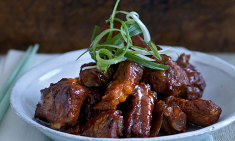

# Chilli Port Spare Ribs

**Serves:** 2-4

## Ingredients
- 570 ml groundnut oil (for deep frying)
- 700 grams pork spareribs (separated into individual ribs) 
** Braising Sauce**
- 900 ml Chinese chicken stock
- 1 tablespoon chilli bean sauce (or 2 teaspoons chilli powder)
- 2 teaspoons sugar
- 70 ml dry sherry or rice wine
- 1 tablespoon dark soy sauce
- 1 tablespoon light soy sauce
- 2 teaspoons garlic (finely chopped)
- 1 tablespoon spring onions (finely chopped)
- 1 tablespoon whole yellow bean sauce
- 1½ tablespoons hoisin sauce

## Method
1. Heat the oil in a deep fryer or a large wok, and deep-fry the spareribs in batches until they are brown and crisp.
1. Drain the spareribs well on kitchen paper and set aside.
1. Combine all the sauce ingredients in a large pot and bring it to the boil.
1. Add the deep-fried spareribs and summer them, covered, for about 40 minutes or until they are tender.
1. Drain off the sauce and remove any remaining fat.
1. This sauce can now be frozen and re-used the next time you wish to make this dish.
1. Pre-heat the oven to 180°C.
1. Put the spareribs onto a rack in a roasting tin and bake them in the oven for 15 - 20 minutes until they are browned, basting them from time to time with the sauce.
1. Serve immediately with bok choi or fried rice.