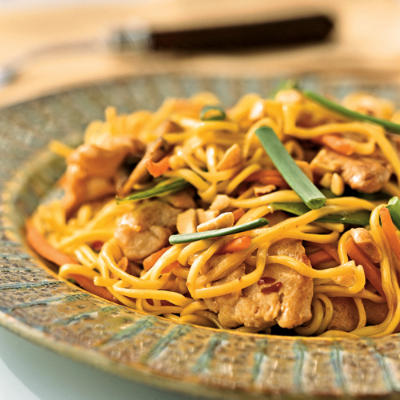

# Chow Mein

*Chow mein literally means 'stir fried noodles' and this dish is as popular outside China as it is in southern China. It is a quick and delicious way to prepare egg noodles.*

**Serves:** 4

## Ingredients
- 225 grams fresh egg noodles
100 grams chicken breast (skinned)
- 2 teaspoons light soy sauce (for the marinade)
- 2 teaspoons dry sherry or rice wine
- 2 teaspoons groundnut oil (for frying the chicken)
- 1 tablespoon groundnut oil (for frying the chow mein)
- 1 teaspoon garlic (finely chopped)
- 50 grams mange tout (trimmed)
- 25 grams Parma ham
- 1 teaspoon light soy sauce (for stir-frying)
- ½ teaspoons sugar
- 1 tablespoon spring onions (finely chopped)
- 1 teaspoon sesame oil

## Method
1. Boil the noodles for 3 - 5 minutes, and immerse in cold water.
1. Using a sharp knife, slice the chicken breasts into fine 5 cm long shreds.
1. Combine the chicken shreds with the 2 teaspoons of light soy and sherry or rice wine in a small bowl.
1. Mix well together and let the chicken marinade for about 10 minutes.
1. Heat a wok or large frying pan, add the 2 teaspoons of oil and then the chicken shreds.
1. Stir-fry the mixture for about 2 minutes and then transfer to a plate.
1. Clean the wok or pan.
1. Drain the noodles, shaking off as much excess water as possible and set aside.
1. Re-heat the pan and add the 1 tablespoon of oil and garlic.
1. Stir fry for about 10 seconds and then add the mange tout and Parma ham.
1. Stir-fry for 1 minutes, and then add the noodles, 1 teaspoon of soy sauce, sugar and spring onions.
1. Continue to stir-fry for about 2 minutes and then return the chicken to the noodle mixture.
1. Continue to stir-fry for about 3 - 4 minutes or until the chicken is cooked.
1. Add the sesame oil and give the mixture a few final stirs.
1. Serve at once.