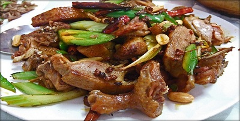

# Crispy Sichuan duck

*In China, duck is usually a treat and reserved for special occasions and banquets. Don't be intimidated by the long preparation process, most of the steps are quite simple and can be done up to a day ahead and the results are well worth the labour. The technique of  steaming renders out most of the fat, leaving the duck meat moist and succulent. The final deep-frying process gives the duck skin a crispy texture.*

**Serves:** 4-6

## Ingredients
- 1 whole duck
- 2 tablespoons five spice powder
- 2 tablespoons salt
- 4 slices fresh ginger
- 4 spring onions
- 1 litre oil (for deep frying)

## Method
### To prepare the duck
1. Rub the inside and out of the duck with the five spice powder and salt, making sure that the powder is rubbed on evenly.
1. Wrap the duck in cling-film and place in the refrigerator for at least 3 hours, preferably longer to allow the flavours to infuse.
1. Cut the ginger and spring onions into thin slices, and stuff into the cavity of the duck.
1. Place the duck on a heatproof plate.

### To steam the duck
1. Set up a steamer or put a rack into a wok or deep pan.
1. Pour about 5 cm of water into the pan and bring to the boil.
1. Put the duck and plate into the steamer or onto the rack, cover with a lid and steam gently for 2 hours.
1. Replenish the water from time to time to keep the steam constant.
1. Remove the duck and pour off all the fat and liquid which may have accumulated.
1. Discard the ginger and spring onions.
1. Keep the duck on a platter in a cool dry place for about 2 hours until it has thoroughly dried and cooled, at this point the duck can be refrigerated.

### To fry the duck
1. Cut the duck into quarters.
1. Heat the oil in a deep-fat fryer or large wok.
1. When the oil is almost smoking, deep-fry the duck quarters in 2 batches until each is crisp and warmed right through.
1. Drain the quarters on kitchen paper and then chop them into smaller serving pieces.