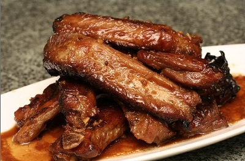

# Five spice spare ribs

*This is a delightful meat dish which engages the senses with may contrasting tastes. The spareribs are first marinated, next deep fried in oil, and then slowly braised in an unusual, piquant sauce.*

**Serves:**  2- 4

## Ingredients
- 700 grams pork spareribs (separated into individual ribs)
- 570 ml groundnut oil (for deep-frying)

**Marinade** 
- 1 tablespoon dry sherry or rice wine
- 1 tablespoon light soy sauce
- 1 tablespoon white rice vinegar
- ½ teaspoon sesame oil

**Sauce** 
- 1 tablespoon garlic (finely chopped)
- 1 tablespoon five spice powder
- 1½ tablespoons spring onions (finely chopped)
- 1 tablespoon sugar
- 1 tablespoon light soy sauce
- 2 teaspoons freshly grated orange peel
- 70 ml cider vinegar

## Method
1. Cut each spare rub into 7 cm long chunks.
1. Mix the marinade ingredients together in a bowl and steep the spareribs for about 25 minutes at room temperature.
1. Heat the oil in a deep-fat fryer or wok.
1. Slowly cook the marinaded spareribs in batches until they are brown, draining each batch on kitchen paper.
1. Put the sauce ingredients into a clean wok or frying pan.
1. Bring the sauce to the boil then reduce the heat.
1. Add the spareribs and simmer them slowly, uncovered, for about 40 minutes, stirring occasionally.
1. Add a little water to the sauce if necessary to prevent it from drying up.
1. Skim any fat off the surface and serve immediately.