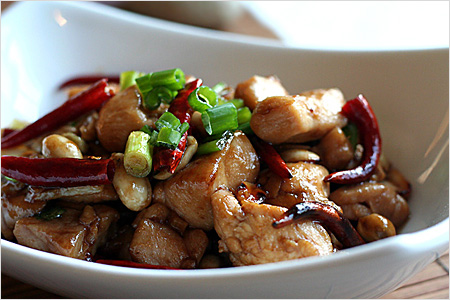

# Sichuan chicken with kung pao sauce

*This recipe comes from the Sichuan region of Western China, where chillies are widely used. Cashew nuts have become a popular ingredient in Chinese cooking..*

**Serves:** 4

## Ingredients
- 2 skinless chicken breasts
- 1 egg white
- 2 teaspoon cornflour
- ½ teaspoon salt
- 2 tablespoon yellow salted beans
- 1 tablespoon hoisin sauce
- 1 teaspoon soft light brown sugar
- 1 tablespoon medium-dry sherry
- 1 tablespoon wine vinegar
- 4 garlic cloves (crushed)
- 150 ml chicken stock
- 3 tablespoons sunflower oil
- 3 dried red chillies (chopped)
- 115 grams roasted cashew nuts
- fresh coriander (to garnish)

## Method
1. Cut the chicken into neat pieces.
1. Lightly whisk the egg white in a dish, whisk in the cornflour and salt, then add the chicken and stir until coated.

### To make the sauce
1. In a bowl, mash the beans.
1. Stir in the hoisin sauce, brown sugar, sherry, vinegar, garlic and stock.

### To cook the chicken
1. Heat a wok, add the oil and stir fry the chicken for 2 minutes until tender.
1. Lift out the chicken and set aside.
1. Heat the oil remaining in the wok and fry the chilli pieces for 1 minutes.
1. Return the chicken to the wok and pour in the bean sauce mixture.
1. Bring to the boil, stir in the cashew nuts and heat through.
1. Spoon into a heated serving dish, garnish with the coriander leaves and serve immediately.