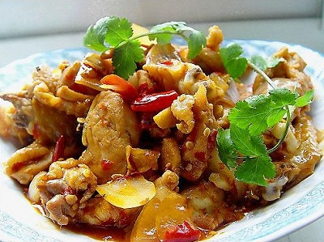

# Kung pao chicken

*This hot and spicy chicken dish can easily be made ahead of time and re-heated. It is a good example of contrasting flavours which characterise the spicy cuisine of western China. The finished dish smells wonderfully fragrant and has an equally delightful taste.*

**Serves:** 4

## Ingredients
- 350 grams chicken pieces
- ½ teaspoon salt
- 2 spring onions
- 150 ml groundnut oil
- 1 teaspoon oil
- 1 dried red chilli (halved length-ways)
- ½ teaspoon fresh ginger (finely chopped)
- ½ teaspoon chilli powder
- 300 ml Chinese chicken stock
- ½ teaspoon Sichuan peppercorns (roasted and ground)
- ½ teaspoon sugar
- 2 teaspoons dark soy sauce

## Method
1. Rub the chicken pieces with salt and let them sit for about 30 minutes.
1. Cut the spring onions into 5 cm pieces.
1. Heat the oil in a wok or large frying pan and then add the dried chilli to flavour the oil.
1. When the chilli turns black, turn the heat down (You can remove the chilli, or leave the chilli in the pan as the Chinese do.)
1. Slowly brown the chicken pieces, a few at a time, skin side down.
1. Turn the chicken over and brown the other side.
1. Drain the chicken pieces on kitchen paper and set aside.
1. Clean the wok and re-heat it.
1. Add 1 teaspoon of oil to the wok and add the spring onions, ginger and chilli powder.
1. Add the chicken stock, Sichuan peppercorns, sugar and soy sauce.
1. Turn the heat down to low and add the chicken pieces.
1. Cover and finish cooking the chicken in the sauce, stirring occasionally for about 20 - 30 minutes.
1. Serve the chicken with the sauce, removing any surface fat.