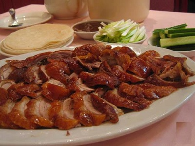

# Peking duck

*The Chinese have a special reverence for duck, regarding it as a symbol of wholesomeness and fidelity. With Peking duck, the Chinese cooks mastered the art of making the most of the duck's rich, succulent flesh while minimising its major flaw - its relatively large proportion of bone and fat.*

*The preparation and cooking of Peking duck is an art form. Specially raised ducklings are fed a rich diet of maize, sorghum, barley and soyabeans for 1½ months before they are ready for the kitchen. After being killed and cleaned, air is pumped through the windpipe to separate the skin from the meat, which allows the skin to roast separately and remain crisp while the fat melts, keeping the meat moist. Hot water is then poured over the duck to close the skin pores and it is hung up to dry. During the drying process a solution of malt sugar is liberally brushed over the duck, which is then roasted in wood-burning ovens. The result is a shiny, crispy and aromatic duck with beautiful brown skin, moist flesh and no fat.*

*What follows is a much simpler method which produces similar results, the duck should be served with Chinese pancakes, spring onions cut into brush shapes and sweet bean or hoisin sauce.*

**Serves:** 4-6

## Ingredients
- 1 whole duck (about 1.6 kg)
Honey syrup mixture
- 1 lemon
- 1 litre water
- 3 tablespoons honey
- 3 tablespoons dark soy sauce
- 150 ml dry sherry or rice wine

**To serve** 
- 12 Chinese pancakes
- 6 tablespoons hoisin sauce
- 24 spring onion brushes

## Method
### To prepare the duck
1. Rinse the duck thoroughly and then make sure the duck is completely dry.
1. Insert a meat hook into the duck near the neck.
1. Using a sharp knife, cut the lemon into 5 mm slices, leaving the rind on.
1. Combine the lemon slices with the rest of the honey syrup ingredients in a large pot and bring the mixture to the boil.
1. Immediately reduce the heat to low, and summer for about 20 minutes.
1. Using a large ladle, pour this mixture over the duck several times, as if to bathe it, until all the skin of the duck is completely coated with the mixture. 
1. Hand the duck in a cool, well ventilated place to dry for at least 6 hours, with a tray under the duck to catch the syrup.
1. The duck is dry when the skin feels like parchment.

### To cook the duck
1. Preheat the oven to 240°C.
1. Place the duck on a roasting rack in a roasting pan, breast side up.
1. Put 150 ml of water into the roasting pan, which will prevent the fat from spluttering.
1. Put the duck into the oven and roast for 15 minutes.
1. Turn the heat down to 180°C and continue to roast for 1 hour and 10 minutes.
1. Remove the duck from the oven and let it sit for at least 10 minutes before you carve it.
1. Using a cleaver or a sharp knife, cut the skin and meat into several pieces and arrange them on a warm platter.
1. Serve at once with Chinese pancakes, spring onion brushes and a bowl of hoisin or sweet bean sauce.