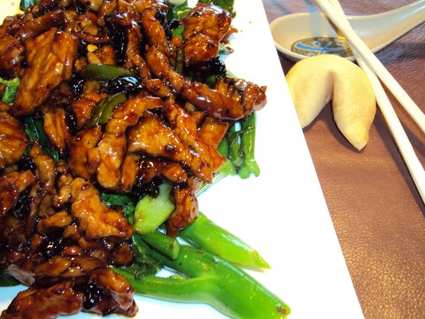

# Shredded beef with chillies

*The essence of this recipe is that the beef is cut into very thin strips. This is easier if the beef is frozen prior to cutting, put the beef in the freezer for 30 minutes before starting.*

**Serves:** 2

## Ingredients
- 225 grams tenderloin beef
- 1 tablespoon light soy sauce
- 1 tablespoon dark soy sauce
- 1 tablespoon medium-dry sherry
- 1 teaspoon dark brown soft sugar
- 6 tablespoon vegetable oil
- 1 large onion (thinly sliced)
- 3 cm piece fresh root ginger (shredded)
- 1 carrot (very fine julienne)
- 3 fresh chillies (finely chopped)
- salt and freshly ground black pepper
- fresh chives (to garnish)

## Method
1. With a sharp knife, slice the beef as thinly as possible, then cut each slice into long shreds. If the beef begins to thaw while cutting, put it back in the freezer for 15 minutes.
1. In a bowl, mix the light and dark soy sauces and add the sherry and sugar.
1. Add the strips of beef and stir well to ensure that they are evenly coated.
1. Cover and marinate in the refrigerator for 30 minutes.
1. Heat a wok and add half the oil.
1. When it is hot, stir-fry the onion and ginger for 3 - 4 minutes, then lift out with a slotted spoon and set aside.
1. Add the carrot, stir-fry for 3 - 4 minutes until slightly softened, then transfer to a plate and keep warm.
1. Heat the remaining oil in the wok, then quickly add the beef, with the marinade, followed by the chillies.
1. Cook over a high heat for 2 minutes, stirring all the time.
1. Return the fried onion and ginger to the wok and stir-fry for 1 minute more.
1. Season with salt and pepper to taste, cover and cook for 30 seconds.
1. Spoon the meat into 2 warmed bowls and the carrot strips. 
1. Garnish with fresh chives and serve.