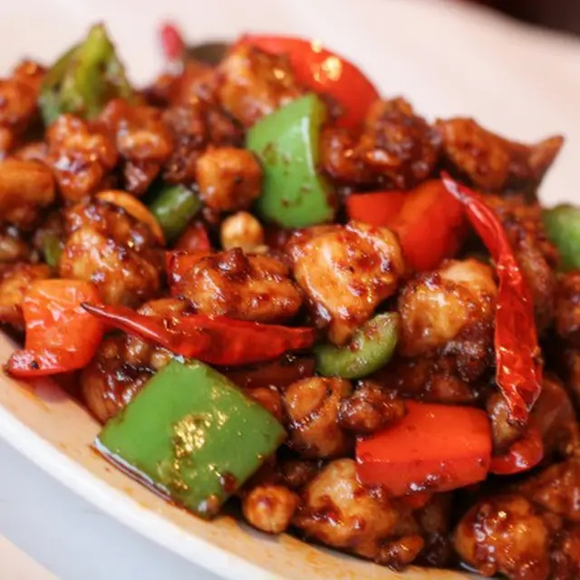

# Sichuan Chicken

**Serves:** 4

## Ingredients
- 250 grams chicken fillets
- 2 cloves (grated)
- 2 cms ginger
- 1/2 tsp. salt
- 1/2 tsp. red chili powder
- 3 cloves (roughly chopped)
- 1/2 red or green bell pepper
- 5 dried chillies
- 2 Tbsp. oyster sauce
- 4 tsp. soy sauce
- 1/4 tsp. black pepper
- 1/4 tsp. sugar
- 250 mL water
- 1 Tbsp. oil

## Method
1. Sprinkle chicken with garlic, ginger, salt and chilli pepper. 
1. Let the chicken rest for 30 minutes.
1. Saute garlic in oil until fragrant.
1. Add bell pepper and dried chilli. Saute until wilted.
1. Add chicken, stir until it begins to brown.
1. Add the oyster sauce, soy sauce, black pepper, and sugar. Stir well.
1. Pour the water, and cook until absorbed and chicken done.
1. Serve with boil rice.