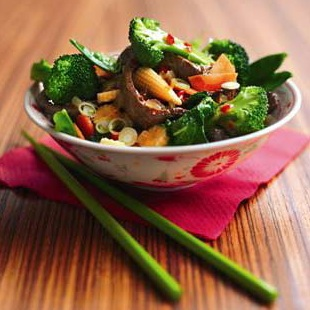

# Sichuan Pepper Beef

*This makes for a fast , easy and delicious supper. The Chinese five-spice powder is the key to this recipe as it flavours the gravy.*

**Serves:**  2

## Ingredients
- 2 Sirloin steaks (cut into strips)
- 2 tablespoon groundnut oil
- 1 medium red chilli (deseeded and chopped)
- ½ onion (chopped)
- 1 small handful broccoli
- 1 small handful chopped mangetout
- 1 small handful chopped carrots
- 1 small handful chopped babycorn
- 300 ml hot fresh beef stock
- 1 tablespoon light soy sauce
- 1 tablespoon cornflour blended with
- 2 tablespoon cold water
- 1 spring onion (finely sliced)
- salt and ground white pepper

**Marinade**
1 tablespoon Shaoshing rice wine
- 2 teaspoons grounded Sichuan pepper
- 1 teaspoon dark soy sauce
- ½ teaspoon Chinese five-spice powder
- 2 garlic cloves (finely chopped)

## Method
1. Mix all the marinade ingredients in a bowl and marinate the beef for as long as possible, overnight is best.
1. Heat a wok over high heat and add the oil. Stir-fry the marinated beef for 2 minutes.
1. Add the red chilli and onion and stir fry for less than 1 minute the add the rest of the vegetables and stir fry for 1 minute.
1. Add the stock (it needs to be hot) and mix well. Season with light soy sauce. Bring to the boil, add the blended cornflour and stir well.
1. Add the spring onion, season to taste and serve with Jasmine rice.