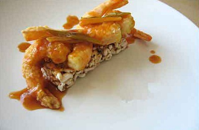

# Sizzling rice prawns

**Serves:** 6-8

## Ingredients
- Ingredients
- 450 grams prawns (shelled and de-veined)
- 2 tablespoons groundnut oil
- 2 teaspoons ginger (finely chopped)
- 1½ tablespoons spring onions (finely chopped)
- 1 litre groundnut oil (for deep frying)
- 1 rice cake (broken into pieces)

**Sauce**   
- 110 grams red or green pepper (diced)
- 1 tablespoon cider or black rice vinegar 
- 1 tablespoon dark soy sauce
- 2 dried red chillies
- 1½ tablespoons tomato purée
- 1 teaspoon light soy sauce
- 1½ tablespoons dry sherry or rice wine
- 1 teaspoon sugar
- 300 ml Chinese chicken stock
- 1 tablespoon cornflour (blended with 1 tablespoon water)

## Method
1. Wash and pat dry the prawns on kitchen paper.
1. Using a sharp knife split the prawns in half but leave them still attached at the back so that they splay out like butterflies.
1. Heat a wok or large frying pan until it is quite hot, then add the 2 tablespoons of oil.
1. Let it heat for a few seconds until it is almost smoking.
1. Add the ginger and stir it quickly for a few seconds, then add the garlic and spring onions.
1. A few seconds later add the prawns and stir-fry them quickly until they become firm (This will take about 30 seconds.)
1. Add all the sauce ingredients except the cornflour mixture.
1. Bring the mixture to the boil and then reduce the heat to a very slow simmer.

### To cook the rice cake
1. Heat the oil in a deep fat fryer or large wok until it is nearly smoking.
1. Drop in a small piece of rice to test the heat, it should bubble all over and immediately come up to the surface.
1. Deep-fry the pieces of rice cake for about 1 - 2 minutes until they puff up and brown slightly.
1. Remove them immediately with a slotted spoon and set them to drain on a plate lined with kitchen paper.
1. Quickly transfer the pieces to a platter and pour the hot prawn and sauce mixture over them.
1. The rice should sizzle dramatically, this can be performed at the table for dramatic effect.