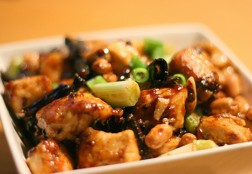

# Spicy chicken with peanuts

*This is a classic western Chinese dish which is better known in china as Gongbao chicken. This dish was named after a Chinese official, Ding Baozhen, who was Governor of Sichuan province in the nineteenth century.*

**Serves:** 4

## Ingredients
- 225 grams boneless chicken breasts
- 1 dried red chilli
- 1½ tablespoons oil
- 75 grams peanuts

**Sauce** 
- 1 tablespoon Chinese chicken stock
- 1 tablespoon dry sherry
- 2 teaspoons dark soy sauce
- 1 teaspoon sugar
- 1 teaspoon garlic (finely chopped)
- 2 teaspoons spring onions (finely chopped)
- ½ teaspoon fresh ginger (finely chopped)
- 1 teaspoon white rice vinegar
- ½ teaspoon salt
- 1 teaspoon sesame oil

## Method
1. Cut the chicken into 2 cm cubes.
1. Split the dried chilli in half length-ways.
1. Heat the wok until it is hot, and add the oil and wait until it is nearly smoking.
1. Add the chilli, cook it until it turns black.
1. Add the chicken cubes and peanuts and stir-fry them for 1 minute.
1. Remove the chicken, peanuts and chilli from the pan.
1. Put all the sauce ingredients, except the sesame oil, into the pan.
1. Bring the sauce to the boil,  then immediately reduce the heat to low.
1. Return the chicken and peanuts to the pan and cook for about 2 minutes in the sauce.
1. Add the sesame oil, and then serve immediately.