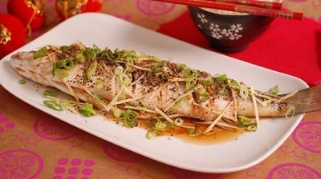

# Steamed fish

*Steaming dish is a great southern Chinese tradition and is considered the preferred method of cooking fish as it brings out the purest flavours of the fish. Because it is such a gentle cooking technique, nothing masks the fresh taste of the fish, which also remains moist and tender.*

**Serves:** 4

## Ingredients
- 350 grams firm white fish fillets 
- 1 teaspoon coarse sea salt
- 1 tablespoon fresh ginger (finely chopped)

**Garnish**  
- 2 tablespoons spring onions (finely chopped)
- 1 tablespoon light soy sauce
- 1 tablespoon groundnut oil
- 1 teaspoon sesame oil
- 2 garlic cloves (thinly sliced)

## Method
1. If you are using whole fish, remove the gills and de-scale the entire fish.
1. Pat the fish dry with kitchen paper and rub salt on both sides. 
1. Set the fish aside fore 3 minutes (This helps the flesh to firm up and draws out any excess moisture).
1. Set up a steamer or put a wire rack into a wok or deep pan.
1. Fill the pan with with 5 cm of water.
1. Bring to the boil, then reduce the heat to a low simmer.
1. Put the fish on a plate and scatter the ginger evenly over the top.
1. Put the plate of fish into the steamer or onto the rack.
1. Cover the pan tightly and gently steam the fish until it is just cooked.
1. Flat fish will take about 5 minutes to cook. Thicker fish such as sea bass will take about 15 minutes.
1. Remove the plate of cooked dish and sprinkle on the spring onions and light soy sauce.
1. Heat the two oils together in a small saucepan.
1. When they are hot, add the garlic slices and brown them.
1. Pour the garlic-oil mixture over the top of the fish and serve at once.