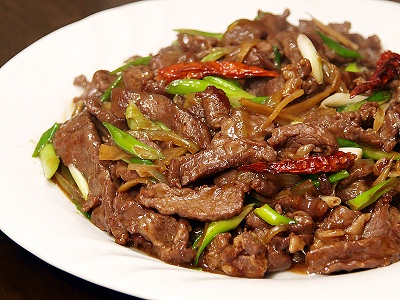

# Stir-fried beef with ginger

*This typically Cantonese dish is of the of the quickest and tastiest ways to cook beef. The ginger adds a subtle and fragrant spiciness.*

*The beef needs to be frozen before cutting, as this will allow the cut to be uniform.*

*This dish goes especially well served on lettuce with oyster sauce.*

**Serves:** 4

## Ingredients
- 350 grams lean beef steak (frozen)
- ¼ teaspoon salt 
- 2 teaspoons light soy sauce
- 2 teaspoons dry sherry
- ½ teaspoon sesame oil
- 1 teaspoon cornflour
- 1 slice fresh ginger
- 1 tablespoon oil
- 1 tablespoon Chinese chicken stock
- ½ teaspoon sugar

## Method
1. Using a very sharp knife, slice the frozen beef into thin strips.
1. Put the beef into a bowl and add the salt, soy sauce, sherry, sesame oil and cornflour.
1. Mix well and let the slices steep in the marinade for about 15 minutes.
1. Meanwhile, finely shred the ginger slice and set aside.
1. Heat a wok or large frying pan and add the oil.
1. When it is very hot and nearly smoking, remove the beef from the marinade using a slotted spoon and stir-fry it for about 2 minutes.
1. When all the beef is cooked, remove it, wipe the wok clean and re-heat it.
1. Add a little oil and stir-fry the ginger for a few seconds.
1. Add the stock and sugar, then quickly return the meat to the pan and stir well.
1. Turn the mixture onto a platter and serve at once.