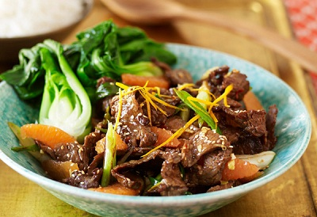

# Stir-fried beef with orange

*This is a northern Chinese beef speciality, which lends itself to using dried tangerine peel. The Chinese always use peel that has been dried, and the older the skin, the more prized the flavour.*

**Serves:** 4

## Ingredients
- 350 grams lean beef steak
- 2 teaspoon dark soy sauce
- 2 teaspoons dry sherry
- 1 teaspoon fresh ginger (finely chopped)
- 1 teaspoon cornflour
- 1 teaspoon sesame oil
- 70 ml groundnut oil
- 2 dried red chillies
- 1 tablespoon dried tangerine peel (soaked and chopped)
- ½ teaspoon roasted Sichuan peppercorns (finely ground)
- 2 teaspoons dark soy sauce
- ¼ teaspoon salt
- 1 teaspoon sugar
- ½ teaspoon sesame oil

## Method
1. Cut the beef into thin slices, about 5 cm long, cutting against the grain.
1. Put the beef into a bowl together with the soy sauce, sherry, ginger, cornflour and 1 teaspoon of sesame oil.
1. Mix well, and then let the mixture marinate for 20 minutes.
1. Heat the groundnut oil in a wok or large frying pan until it is very hot.
1. Remove the beef from the marinade with a slotted spoon, and add it to the pan and stir fry for 2 minutes, until it browns.
1. Remove the beef and leave to drain in a colander or sieve.
1. Pour off most of the oil in the wok, leaving about 1 teaspoon.
1. Re-heat the pan over a high heat and then add the dried chillies.
1. Stir-fry them, for 10 seconds, and then return the beef to the pan.
1. Add the remaining ingredients and stir-fry for 4 minutes, mixing well.
1. Serve at once.