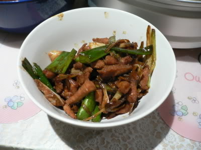

# Stir-fried pork with spring onions

*This is a simple stir-fried dish in the southern Chinese tradition. The key to success is not to overcook the pork.*

**Serves:** 4

## Ingredients
- 350 grams boneless lean pork
- 2 teaspoons dry sherry
- 2 teaspoons light soy sauce
- ½ teaspoon cornflour
- 4 spring onions
- 2 teaspoons oil
- ½ teaspoon salt
- ½ teaspoon sugar

## Method
1. Cut the pork into thin slices, about 5 cm long.
1. Put the sliced pork into a bowl and mix in the dry sherry, soy sauce and cornflour.
1. Let the mixture sit for 10 - 15 minutes so that the pork absorbs the flavours of the marinade.
1. Cut the spring onions on the diagonal into 5 cm lengths.
1. Heat a wok to a very high heat, and add the oil.
1. When it is almost beginning to smoke, add the pork slices and stir-fry them until they are brown.
1. Add the spring onions, salt and sugar.
1. Continue to stir-fry until the pork is cooked and slightly firm. This should take about 5 minutes.
1. Remove and arrange the pork on a warm serving platter.
1. Pour over any juices and serve at once.