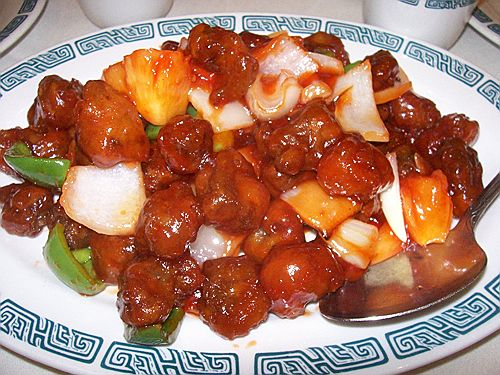

# Sweet and sour pork

*Of all Chinese dishes, sweet and sour pork is probably one of the best known in the west. Unfortunately for Westerns it is rarely properly made, often consisting of heavy, doughy balls containing a scrap of pork drenched in a sweet, red sauce. Properly prepared, sweet and sour Chinese dishes are so delicately balanced that one is hard pressed to describe them as either strictly sweet or sour.*

*This dish is best served with plain steamed rice and a simple blanched vegetable such as Bok Choi in soy sauce.*

**Serves:** 4

## Ingredients
- 350 grams lean pork
- 1 tablespoon dry sherry
- 1 tablespoon light soy sauce
- ½ teaspoon salt
- 50 grams green pepper
- 50 grams red pepper
- 50 grams carrots
- 50 grams spring onions
- 1 egg (beaten)
- 2 tablespoons cornflour
- 400 ml oil (preferable groundnut)

**For the sauce** 
- 150 ml Chinese chicken stock
- 1 tablespoon light soy sauce
- ½ teaspoon salt
- 1½ teaspoons cider vinegar (or white rice vinegar)
- 1 tablespoon sugar
- 1 tablespoon tomato purée
- 1 teaspoon cornflour
- 1 teaspoon water
- 75 grams tinned lychees

## Method
1. Cut the pork into 2 cm cubes.
1. Put the cubes into a bowl together with the sherry, soy sauce and salt and leave to marinate for 20 minutes.
1. Meanwhile, cut the green and red peppers into 2 cm squares.
1. Peel and cut the carrots and spring onions into 2 cm cubes.
1. Bring a pot of water to the boil and blanch the carrots in to for 4 minutes.
1. Remove the carrots and plunge into ice cold water, drain and set aside.
1. Mix the egg and cornflour in a bowl to a uniform batter.
1. Lift the pork cubes out of the marinade and place them in the batter to coat each piece well. 
1. Heat the oil in a deep-fryer or large wok until it is almost smoking.
1. Remove the pork pieces from the batter with a slotted spoon, and deep-fry them.
1. Drain the deep-fried pork cubes on kitchen paper.
1. Combine the chicken stock, soy sauce, salt, vinegar, sugar and tomato purée in a large saucepan.
1. Add all the vegetables and stir well.
1. In a small bowl, blend together the cornflour and the water.
1. Stir this mixture into the sauce and bring it back to the boil.
1. Turn the heat down to a simmer.
1. Add the lychees and pork cubes.
1. Mix well, and then turn the mixture onto a deep platter and serve at once.