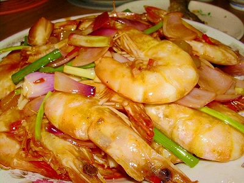

# Sweet and sour prawns

**Serves:** 4

## Ingredients
- 225 grams prawns (shelled and de-veined)
- 110 grams tinned or fresh waterchestnuts (drained)
- 75 grams red or green pepper (roughly chopped)
- 2 spring onions
- 2 teaspoons groundnut oil
- 2 teaspoons garlic (finely chopped)

**Sauce**  
- 70 ml Chinese chicken stock
- 1 tablespoon dry sherry or rice wine
- 2 teaspoons light soy sauce
- 1 tablespoon tomato purée
- 1 tablespoon cider vinegar
- 1 tablespoon sugar
- 2 teaspoons cornflour (blended with 2 teaspoons water)

## Method
1. Wash the prawns and pat dry them on kitchen paper.
1. Slice the water chestnuts, and cut the spring onions diagonally into 3.5 cm pieces.
1. Heat a wok or large frying pan, and when it is hot add the oil and stir-fry the prawns for 1 minute.
1. Remove them with a slotted spoon and drain on kitchen paper.
1. Add the garlic and spring onions to the pan and stir-fry them for a few seconds.
1. Add the pepper and fresh waterchestnuts if you are using them and stir-fry fro 30 seconds.
1. Add the sauce ingredients.
1. Bring the mixture to the boil and simmer for 4 minutes.
1. If you are using tinned waterchestnuts, add these now.
1. Boil over a high heat for another 30 seconds and serve immediately with steamed rice.