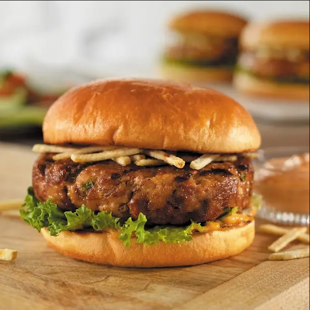

# Cuban-Style Pork Burgers

**Serves:** 6

## Ingredients
- 27 grams spanish chorizo
- 454 grams pork mince
- 36 grams dried bread crumbs 
- 1 large egg (beaten)
- 1 small yellow onion (minced)
- 50 grams green bell pepper (minced)
- 1 clove garlic (minced)
- 1/4 tsp. kosher salt
- 6 hamburger buns (split)
- 6 Tbsp. thousand island dressing
- 300 grams potatoes (shoestring, potato sticks)
- 6 lettuce leaves (green)

## Method
1. Finely chop chorizo in a food processor or with a large knife. Gently mix together ground pork, chopped chorizo, breadcrumbs, egg, onion, green pepper, garlic and salt.Shape into 6 patties about 3/4-inch thick.Refrigerate for 10 to 15 minutes.

1. Place a griddle pan over a medium-high heat until it becomes hot.

1. Place burgers in the pan, and cover.

1. Grill burgers for 5 minutes.

1. Turn and finish cooking for 4 to 5 minutes more, until cooked through.

1. Toast buns about 1 minute per side.

1. Build burgers on buns with 1 1/2 tablespoons dressing, 1/3 cup shoestring potatoes and one lettuce leaf.
