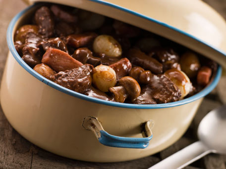

# Beef Bourguignon (Boeuf Bourguignon)

*This dish was once called pièce de boeuf à la bourguignonne ( a piece of beef cooked in the style of Burgandy). This would have been prepared with a rump roast weighing at least 2 kilograms, cooked whole. Now the custom is to chop the meat into cubes, so that the dish doesn't have to cook quite as long.*

*The best red wine sauce includes a bit of flour. Classic French cuisine used much too much, and the 'nouvelle cuisine' of the 1970's banished it heedlessly. Flour deserves neither this excess of honour nor this complete refusal; well used, as it is here, it does a fine job of thickening sauces.*

**Prep Time:** 20 minutes
**Cooking Time:** 2 hours and 15 minutes
**Extra Time:** 25 minutes for onions, 5 minutes for lardos, 10 minutes for mushroom
**Serves:** 4-6

## Ingredients
- 1 bottle of red wine (preferably Burgundy)
- Peanut oil
- 60 grams butter
- 900 grams rump pot roast (cut into 5 cm cubes)
- 2 medium carrots (sliced into 5 mm rounds)
- 2 medium onions (sliced into 5 mm rounds)
- 2 tablespoons flour
- Crushed pepper
- 750 ml beef broth 
- 1 bouquet garni
- 2 cloves garlic (de-germed)
- 16 small cippoline onions (peeled)
- 1 teaspoon sea salt
- 1 teaspoon caster sugar
- 125 grams lardons
- 150 grams button cup mushrooms (cleaned and stems trimmed)
- 1 tablespoon parsley (finely chopped)
- salt and pepper

## Method
1. Put the wine in a saucepan and bring to the boil. Simmer gently for 20 minutes.
1. Meanwhile, heat 1 tablespoon of peanut oil in a large saucepan or casserole. 
1. Add 45 grams of butter; when it foams, add the cubes of meat.
1. Brown the meat for 5 minutes over a medium heat, stirring with a wooden spoon to ensure the meat is seared all over.
1. Using a skimmer or slotted spoon, remove the meat to a deep dish.
1. Put the carrots and onions into the pan in which the meat was browned and cook for 5 minutes over a very low heat, stirring once or twice to keep them from darkening.
1. Sprinkle the meat with the flour and throw it back into the pan along with 1 scant teaspoon of crushed black pepper.
1. Turn the heat to medium and cook, stirring constantly for 5 minutes, just long enough to remove the flour's raw taste.
1. Pour half of the broth into the pan and stir. Then pour in the wine and the rest of the broth; it should come just high enough to cover the meat.
1. Add the bouquet garni and garlic and cover. 
1. Simmer gently for 2 hours; skimming the foam from the sauce, and then stirring every 30 minutes.
1. While the meat cooks, put the small onions into a saucepan with 1 litre of water and a teaspoon of sea salt. Bring the liquid to a boil and simmer the onions for 2 minutes, then drain into a colander.
1. Melt 15 grams of butter in a sauté pan. Add the onions and caster sugar; season with salt and pepper, cover, and cook over a gentle heat for 20 minutes, rotating the pan every 5 minutes, until the onions are quite tender and pale golden. Then drain into a colander.
1. Heat 1 teaspoon of oil in a frying pan, then add the lardons.
1. Cook the lardons for 5 minutes, stirring, over a medium heat. 
1. When the lardons are browned, remove them with a slotted spoon and place them on top of the onions.
1. Add the mushrooms to the pan that the lardons were fried in, keeping the oil in the pan, and cook over a medium heat for 10 minutes, stirring.
1. Season the mushrooms lightly with salt and pepper before adding the mushrooms to the lardons and the onions.
1. When the stew has been simmering for 2 hours, use a large spoon to remove the grease from its surface.
1. Remove the meat with a slotted spoon and put it in a large, deep serving dish.
1. Put the lardons, onions, and mushrooms into the same dish.
1. Strain the meats sauce through a chinois or fine-meshed conical sieve into another saucepan and bring it to a simmer. Allow to simmer for 5 minutes.
1. Taste for seasoning, the sauce should be quite peppery.
1. Pour this sauce over the meat and vegetables and sprinkle with the parsley.