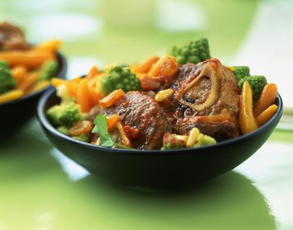

# Lamb stew (Navarin d'agneau)

*The French name for this stew, navarin almost certainly comes from the word for turnip, navet, thought today it is made with potatoes not turnips. You can divide these quantities by 2 to make a stew for 4, but this dish is best made in larger quantities.*

*The meat is best when it has been cut into 5 cm cubes.*

**Prep Time:** 30 minutes
**Cooking Time:** 1 hour and 20 minutes
**Serves:** 8

## Ingredients
- 3 tablespoons olive oil
- 1 kilogram lamb shoulder (cubed)
- 500 grams lamb neck (cubed)
- 500 grams lamb breast (cubed)
- 3 carrots (chopped into 5 mm dice)
- 3 onions (chopped into 5 mm dice)
- 30 grams flour
- 1 bouquet garni
- 4 cloves of garlic (peeled and crushed)
- 1 large tomato (cut into large dice)
- 1.2 kilogram small, firm fleshed potatoes (charlottes)
- 15 grams butter
- 250 grams small new pearl, or cippoline onions (peeled)
- 1 teaspoon caster sugar
- 2 tablespoons flat leaf parsley (finely chopped)
- sea salt
- fine salt
- pepper

## Method
1. Heat the olive oil in a large cocotte over a high heat for 1 minute.
1. Add the cubed meat and brown for 5 minutes, stirring so the meat is seared all over.
1. Add the carrots and diced onions, and then lower the heat and cook for 5 minutes, stirring continuously.
1. Sprinkle the flour over the cooking vegetables and meat, and cook for 2 minutes, until the vegetables are lightly coloured.
1. Add the bouquet garni, garlic and tomato.
1. Add just enough water to cover everything.
1. Turn the heat to high and bring to a boil.
1. Using a skimmer, remove any foam that forms on the surface.
1. Add 2 teaspoons of sea salt and 4 turns of the pepper mill.
1. Cover, lower the heat so the mixture simmers gently, and cook for 50 minutes, skimming and stirring every 15 minutes.
1. Meanwhile, wash and peel the potatoes. Put them in a saucepan, cover them with cold unsalted water, bring the water to a boil, and cook for 1 minutes. Strain the potatoes into a colander.
1. When the lamb has cooked for 50 minutes, remove the pan from the heat. 
1. Remove the bowl with a slotted spoon or skimmer and put it in a large bowl. 
1. Pour the cooking broth through a chinois or fine-meshed conical sieve into the bowl with the lamb, and then put the strained broth and lamb back in the cocotte.
1. Add the potatoes, cover, and put the pan back over a gentle heat for 20 - 25 minutes.
1. Meanwhile, melt the butter in a sauté pan.
1. Add the small onions and cook for 5 minutes over a low heat, stirring constantly.
1. Add enough water to cover the onions and season with a pinch of fine salt and the caster sugar. cover and cook for 20 minutes over a very low heat, stirring from time to time.
1. After 20 - 25 minutes, turn off the heat from under the pan of meat and potatoes.
1. Prepare a bowl half full of cold water; spoon some of the cold water gently onto the surface of the stew, then spoon away the fat that rises to the surface. Rinse the spoon in the cold water after each removal of fat.
1. When the onions are cooked, arrange them on top of the stew and sprinkle with parsley.
1. Serve the stew from the pan at the table.