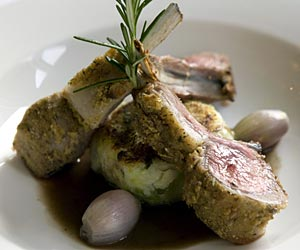

# Breast of lamb with a mustard and herb crust

*Breast of lamb is a cut of meat taken from the belly. Although this is a relatively cheap cut of meat, it is packed with flavour.*

*Make sure the lamb has been skinned, boned and any excess fat has been removed. Any bones can always be added to the stock during cooking to increase the lamb flavour.*

**Serves:** 4

## Ingredients
- 4 portions of lamb breast (rolled and tied)
- 2 tablespoons of lamb fat or cooking oil
- 50 grams unsalted butter
- 1 garlic clove (crushed)
- 1 sprig fresh thyme
- 1 sprig fresh rosemary
- 2 sage leaves
- 1 onion (diced)
- 2 carrots (diced)
- 2 celery sticks (diced)
- half leek (diced)
- 1.2 litres chicken stock
- lamb bones (optional)
- 2 teaspoons Dijon or grain mustard
- 150 ml double cream

### For the crust
- 1 teaspoon chopped mixed thyme, sage and rosemary
- 2 teaspoons Dijon or grain mustard
- 6 slices white bread
- 25 grams butter
- 2 shallots (finely chopped)
- salt and freshly ground black pepper

## Method
### To make the crust 
1. Remove and discard any crusts from the bread and cut into quarters.
1. Put the bread into a food processor, and process until you have fine crumbs.
1. Melt the butter with the shallots and bring to a simmer.
1. Remove from the heat and allow to cool.
1. Gradually spoon some of the shallot butter into the crumbs, mixing all the time.
1. The mix will be ready when it holds once pressed together, but it should still stay free flowing.
1. Add the chopped mixed herbs and flavour with the mustard.

### To cook  the lamb breasts
1. Heat a frying pan and colour the lamb breasts in the fat or oil.
1. Melt half the butter in a braising pan and fry the garlic, herbs and vegetables slowly for a few minutes.
1. Add the stock and lamb bones (if using) and bring to a simmer.
1. Add the lamb breasts and summer until tender, which will take about 2 hours.
1. Once cooked, the lamb can be left in the stock and jellied to use later, or taken out of the stock and finished with the crust.

### To crust the lamb
1. Cut the meat into 1 cm slices and separate into portions.
1. Push the slices together, just slightly parted at an angle.
1. Top with the herb crust and crisp under a hot grill until golden brown.

### To make the sauce
1. Reduce some of the cooking liquor to about 300 ml.
1. Thicken with the remaining butter and add the double cream, cooking for 5 - 10 minutes, then add 1 - 2 teaspoons of mustard and serve.