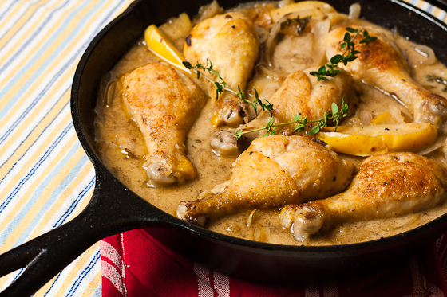

# Normandy chicken

**Prep Time:** 25 minutes
**Cooking Time:** 45 minutes
**Serves:** 6-8

## Ingredients
- 40 grams butter
- 6 chicken legs
- 8 shallots, peeled
- 3 sticks celery, chopped, plus a few leaves to garnish
- 300 ml dry cider
- 300 ml chicken stock
- 2 apples, cored and cut into wedges
- 2 teaspoons cornflour
- 5 tablespoons crème fraîche
- 2 tablespoons Dijon mustard
- 1 tablespoon chopped tarragon (plus extra whole leaves to serve)

## Method
1. Heat the oven to 190°C
1. Heat half of the butter on the hob in a large casserole dish and add the chicken. 
1. Cover and cook on a high heat for 10 minutes, until browned all over, turning as needed. 1. Season well.
1. Add the shallots and celery, cook for a few minutes, then add the cider and stock. 
1. Bring to the boil, cover and cook in the oven for 40 minutes. 
1. Test to see if the chicken is cooked by inserting a sharp knife, it's ready when the juices run clear.
1. Meanwhile, heat the rest of the butter in a non-stick frying pan and add the apple wedges. 
1. Fry on both sides until lightly browned. 
1. Set aside and keep warm.
1. Mix to the cornflour with 2 tablespoons of crème fraîche, to make a smooth paste. 
1. Lift out the chicken, and keep warm. 
1. Add the cornflour mixture, the remaining crème fraîche, mustard and chopped tarragon to the casserole liquid.
1. Bring to the boil on the hob, then simmer for 3 minutes, until it has thickened and is smooth.
1. Serve the apple wedges and sauce spooned over the chicken, and garnish with the celery and tarragon leaves.