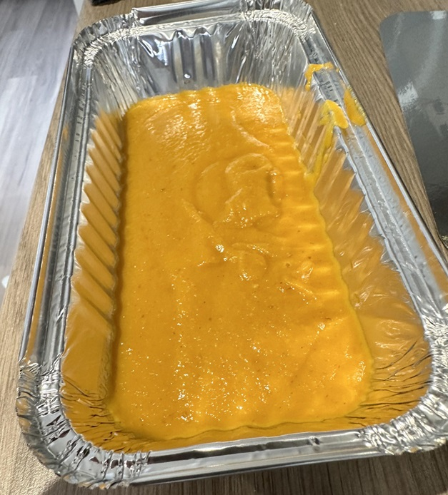

# B.I.R Curry Base

*Classic British Indian Restaurant(B.I.R.) curry base*

*This is the classic curry base that is used in most UK Indian restaurants. The finished sauce has a sweet taste and should be a thick consistency.*

**Yield:** 4kg

## Ingredients
- 4 kg Onions (roughly chopped)
- 1 tsp cumin seeds
- 3L Water 
- 500ml Vegetable oil
- 2 tbsp salt
- 2 tbsp turmeric
- 1 rounded tsp garam masala
- ½ tsp chilli powder
- 30g coconut cream
- 2tbs tomato purée 

## Method
Remember to periodically stir during the following process to stop the onions from burning. Add a little water if it reduces too much
### Step 1
- Place onions and water in a large pot.
- Sprinkle cumin seeds over onions.
- Cook for 2 hours over a medium heat

### Step 2
- Add oil.
- Cook for a further 1 hour.

### Step 3
- Add remaining ingredients.
- Cook for ½ an hour.

### Step 4
- Allow to cool slightly.
- Blend into a smooth sauce.
- Cook for ½ an hour over a low heat.
