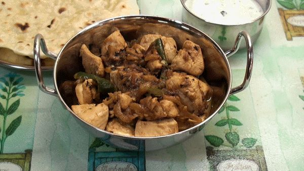

# Pre-Cooked Chicken

*Pre-cooking chicken until it is just cooked through really helps intensify the flavour of curries, especially when including the cooking stock.*

**Prep Time:** 10 minutes   
**Cooking Time:** 2 hours

## Ingredients
- 2 Kg Chicken Breasts, cut into bite-sized chunks (approx. 8 per breast)
- 4 Tbsp Rapeseed oil
- 5 Green Cardamom pods (bruised)
- 10 Black Peppercorns
- 1 Inch piece of Cinnamon (Cassia Bark)
- 1 tsp Cumin seeds
- 1 tsp coriander seeds
- 3 Indian Bay leaves
- 2 Large Onions (finely chopped)
- ½ tsp sea salt
- 2 Tbsp Garlic and Ginger paste
- 1 tsp ground turmeric
- 2 x 400g tins chopped Tomatoes
- Water (to cover)
- 1 tsp [Garam Masala](garam-masala.md)

## Method
1. Heat the oil in a pan over a medium–high heat until small bubbles form.
2. Add the whole spices and bay leaves, and stir continuously for about 30 seconds to release their flavours into the oil.
3. Add the onions and stir regularly for about 5 minutes until soft and translucent.
4. Sprinkle the salt over the top; this will help release moisture from the onions.
5. Add the garlic and ginger paste.
6. Add the turmeric.
7. When fragrant with the aroma of garlic and ginger, tip in the tomatoes.
8. Reduce the heat to medium for about 5 minutes.
9. Add the chicken pieces and just enough spice stock or water to cover the chicken.
10. Reduce the heat and let the stock softly bubble until the chicken is just cooked through.
11. Stir in the garam masala and, using a slotted spoon.
12. Remove the chicken pieces, reserving a little cooking stock.
13. Turn the heat down to low so the remaining stock simmers.
14. Simmer for about 45 minutes.
