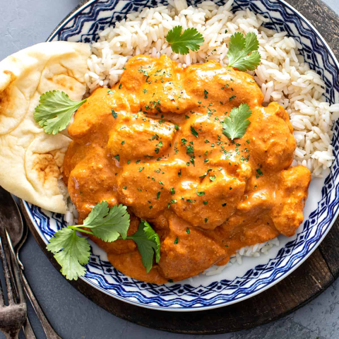

# Butter Chicken

*In 1947, Kundan Lal Gujral opened the first tandoori restaurant, called Moti Mahal, in Delhi, India. Although tandoor-style ovens had already been used for thousands of years, he was the first to have large tandoors manufactured for use in a restaurant.*
*The restaurant served delicious marinated chicken, meat and vegetables, all charred to perfection in a tandoor. Not one to waste, Gujral came up with the idea of using the leftover marinades in a curry, and butter chicken (murgh makhani) was born.*

**Serves:** 4

## Ingredients
- 1.5kg [grilled tandoori chicken](../side-dishes/tandoori-chicken-tikka.md)

### For the sauce
- 4 tbsp rapeseed oil or seasoned oil
- 2.5cm (1in) piece of cinnamon stick
- 2 star anise 
- 6 green cardamom pods (lightly bruised)
- 2 Indian bay leaves
- 2 onions (finely chopped)
- 1 carrot, grated 
- 2 tbsp garlic and ginger paste
- 2 X 400g tins of chopped tomatoes 
- 1 tsp paprika 
- 1 tbsp ground cumin 
- 1 tbsp ground coriander 
- 1 tsp ground turmeric 
- 300ml double cream 
- 3 tbsp butter, chilled 
- 1 tbsp [garam masala](../Base/garam-masala.md)
- Salt and freshly ground pepper 

## Method
1. Heat the oil in a large saucepan over medium-high heat. 
1. When hot, toss in the cinnamon stick, star anise, cardamom pods and bay leaves, and stir them in the oil for about 30 seconds. 
1. Add the onions and carrot, and fry for about 15 minutes, stirring occasionally, so that the onions turn soft and translucent but not browned. 
1. Sprinkle 1 tsp salt over the top to help release some of the moisture from the onions. 
1. Add the garlic and ginger paste and fry for 30 seconds, followed by the chopped tomatoes. 
1. Add the paprika and the ground cumin, coriander and turmeric, and simmer for about 3 minutes. 
1. Remove the whole spices and blend it to a smooth sauce. 
1. Lower the heat to medium and place the grilled chicken pieces in the sauce to heat through. 
1. To finish, whisk in the cream and reserved marinade from preparing the chicken, and turn the heat back up to medium-high. 
1. Add the chilled butter, 1 tbsp at a time, and check for seasoning, adding more salt if needed. 
1. Sprinkle with the garam masala and serve.