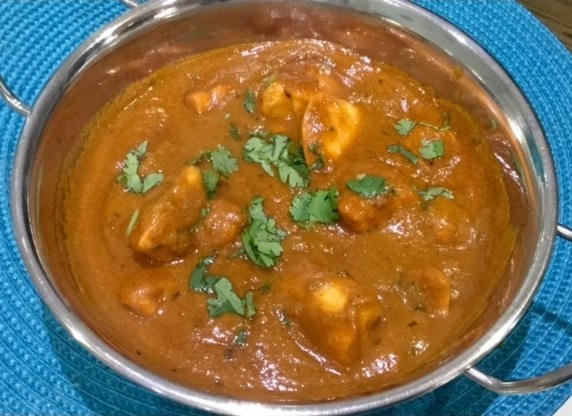

# Chicken Ceylon

**Serves:** 4

## Ingredients
- 4 tbsp rapeseed oil or seasoned oil
- 800g [pre-cooked chicken](../Base/pre-cooked-chicken.md)
- 125ml [chicken stock](../Base/pre-cooked-chicken.md)
- 2 star anise 
- 3 inch piece of cinnamon stick
- 4 green cardamom pods (bashed )
- 20 fresh or frozen curry leaves 
- 2 tbsp garlic and ginger paste 
- 2 green bird’s-eye chillies (finely chopped )
- 2 tbsp coconut flour 
- 3 tbsp finely chopped coriander
- 1 tsp Kashmiri hot chilli powder 
- 2 tbsp [mixed powder](../Base/mixed-powder.md)
- 1 tbsp [tandoori masala powder](../Base/tandoori-masala-powder.md)
- 1/2 tbsp freshly ground black pepper 
- 125ml tomato purée 
- 625ml [base curry sauce](../Base/curry-base.md)
- 100g block coconut (cut into sinall pieces)
- 1 tsp dried fenugreek (methi) leaves 
- 2 tbsp smooth mango chutney 
- Sugar, to taste 
- Juice of 1 lime 
- 1 tsp [garam masala](../Base/garam-masala.md)
- 3 tbsp freshly chopped coriander
- Salt 

## Method
1. Heat the oil in a large pan over a medium-high heat until it is visibly hot. 
1. Add the star anise, cinnamon stick and cardamom pods, and stir around for about 30 seconds until fragrant; be careful not to burn them. 
1. Add the curry leaves and fry for 30 seconds until their scent fills the room. 
1. Add the garlic and ginger paste and the chopped chillies. Both will sizzle in the pan as they release their moisture and flavour into the oil. 
1. When they quieten down, after about 30 seconds, add the coconut flour and mix it all together for a few seconds before adding the coriander stalks, chilli powder, mixed powder, tandoori masala, black pepper and tomato purée. 
1. Now stir in about 250ml of the base curry sauce and let it reduce for about a minute, stirring the caramelized bits into the sauce. 
1. Add the pre-cooked chicken, the rest of the base curry sauce, the stock and block coconut pieces. 
1. Let the sauce simmer for about 5 minutes until you are happy with the consistency, only stirring if it looks like it is catching on the pan. 
1. Stir in the dried fenugreek leaves, mango chutney. 
1. Fish out the whole spices if you want and add salt and sugar to taste. 
1. Squeeze the lime juice over the top and sprinkle with the garam masala and chopped coriander to serve. 