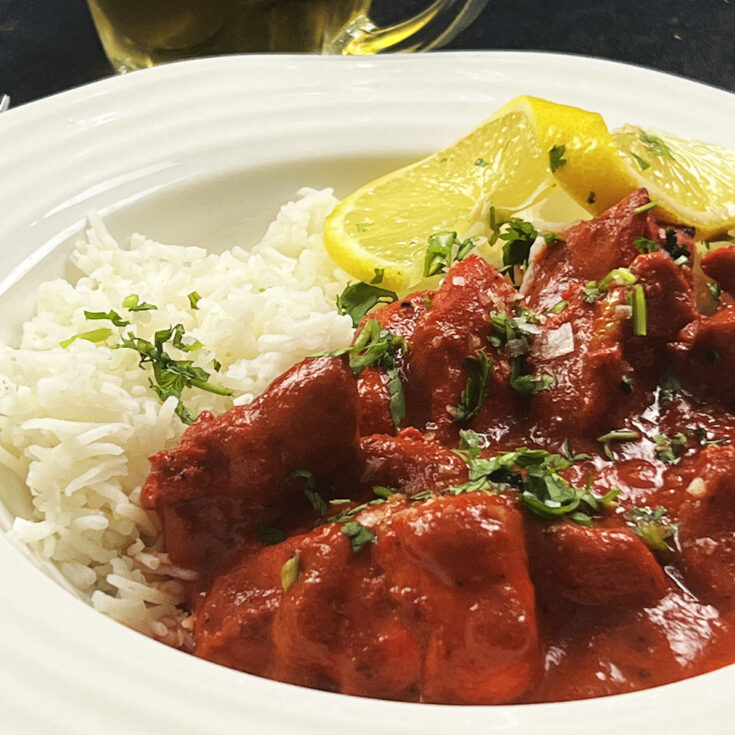

# Chicken Chasni

**Serves:** 4

## Ingredients
- 3 tbsp ghee or rapeseed oil or seasoned oil
- 2 tbsp garlic and ginger paste
- ½ tsp ground turmeric 
- 500ml [base curry sauce](../Base/curry-base.md) (heated )
- 800g [pre-cooked stewed chicken](../Base/pre-cooked-chicken.md)
- 125ml of curry base or stock from [pre-cooked stewed chicken](../Base/curry-base.md)
- 3 tbsp smooth mango chutney
- 2 tbsp mint sauce 
- 3 tbsp tomato ketchup 
- 1 tbsp ground cumin 
- 200ml double cream 
- Juice of 1 or 2 lemons, to taste 
- Bright red food colouring powder (optional) 
- ½ tsp [garam masala](../Base/garam-masala.md)
- 3 tbsp very finely chopped coriander
- Salt 

## Method
1. Heat the ghee or oil in a large pan over a medium-high heat. 
1. When the oil is visibly hot, add the garlic and ginger paste; it will sizzle as it releases its moisture into the hot oil. 
1. Add the turmeric and fry for about 40 seconds, stirring continuously, then pour in 250ml of the base curry sauce. 
1. Let this come to a rapid simmer and scrape any caramelized sauce from the sides of the pan into the sauce. 
1. Add the rest of the base sauce with the pre-cooked chicken and the stock. 
1. Let this cook for about 5 minutes, only stirring if the sauce is obviously catching on the pan, and stirring in any caramelized sauce from the side of the pan. 
1. Stir in the mango chutney, mint sauce and ketchup followed by the cumin. 
1. Pour in the cream and simmer until good and hot. 
1. Season with salt and squeeze in the lemon juice to taste. 
1. Add red food colouring powder if you want and sprinkle with the garam masala and chopped coriander to serve. 
