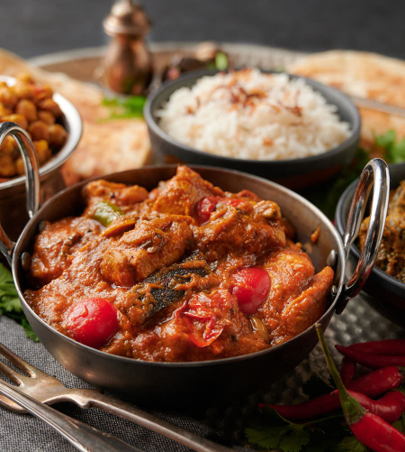

# Chicken Chilli Garlic

*A great spicy and garlicy chicken dish*

**Serves:** 4

## Ingredients
- 4 tbsp rapeseed oil or seasoned oil
- 15 garlic cloves, cut into thin slivers 
- 1 onion, finely chopped 
- 4 tsp salt 
- 2 tbsp garlic and ginger paste 
- 3 (or more) fresh green chillies, sliced into thin rings, plus extra to serve
- 1 tsp chilli powder 
- 2 tbsp [mixed powder](../Base/mixed-powder.md)
- 2 tbsp [tandoori masala ](../Base/tandoori-masala-powder.md)
- 125ml [tomato purée ](../Base/tomato-puree.md)
- 500ml [base curry sauce](../Base/curry-base.md) (heated )
- 800g [pre-cooked stewed chicken](../Base/pre-cooked-chicken.md)
- 125ml of chicken stock or stock from [pre-cooked stewed chicken](../Base/curry-base.md)
- 1 tsp dried fenugreek (methi) leaves 
- Salt 
- Small bunch of coriander (finely chopped)
- Dried garlic flakes, to serve (optional) 

## Method
1. Heat the oil in a pan over a medium heat and add the garlic slivers. 
1. It is very important not to burn the garlic, so watch the pan and move the slivers around in the pan until they become soft and are just beginning to brown. 
1. Now add the onion and fry for about 3 minutes until soft and translucent, sprinkling a little salt over the onions to help release moisture. 
1. Stir in the garlic and ginger paste and chillies, and fry for about 20 seconds. 
1. Increase the heat to medium-high, add the ground spices and tomato purée and sizzle for a further 30 seconds, stirring continuously. 
1. Add half the base curry sauce and bring to a rolling simmer. (You don’t need to stir the sauce unless it is obviously catching on the pan.) Be sure to scrape any sauce that caramelizes on the sides of the pan back into the sauce. 
1. Pour in the rest of the base sauce, the chicken and cooking stock and let this bubble without disturbing until the chicken is heated through and your sauce consistency is how you like it. 
1. Stir in the dried fenugreek leaves and check for seasoning, adding salt to taste. Sprinkle with the chopped coriander, dried garlic flakes and a few more chilli rings, if you like. 
